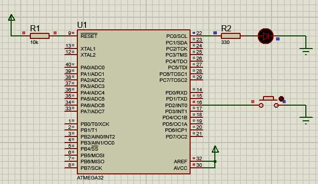

<!-- PROJECT TITLE -->
<h1 align="center">Extrenal Interrupt Handling Using ATmega32</h1>

<!-- OVERVIEW -->
## <br>**➲ Overview**
This project demonstrates how to handle external interrupts using the ATmega32 microcontroller. When a push button connected to the INT0 pin (PortD Pin2) is pressed, it triggers an external interrupt. In response to the interrupt, an interrupt service routine (ISR) is called, which turns on an LED connected to PortC Pin0.

<!-- HARDWARE REQUIREMENTS -->
## <br>**➲ Hardware Requirements**
* IMTSchool Development Kit (or a compatible hardware setup)
* USBASP Programmer (or another suitable programmer)
* Jumper wires

<!-- SOFTWARE REQUIREMENTS -->
## <br>**➲ Software Requirements**
* <a href="https://www.eclipse.org/downloads/packages/release/2023-06/r/eclipse-ide-cc-developers" target="_blank">Eclipse IDE</a> 
* <a href="https://www.labcenter.com/downloads/" target="_blank">Proteus</a> 
* <a href="https://sourceforge.net/projects/winavr/" target="_blank">WinAVR</a> 
* <a href="https://www.fischl.de/usbasp/" target="_blank">USBASP driver</a> 

**NOTE:** you can install another simulation program like multisim and another IDE like Microship studio or VS code with external compiler, anything can work all you need is to compile the project to generate hex file.

<!-- PROJECT STRUCTURE -->
## <br>**➲ Project Structure**
The project is structured as follows:
* main.c: The main application code responsible for counting and controlling the LEDs based on the 7-segment display's value.
* STD_TYPES.h: A header file containing standard data types for the project.
* BIT_MATH.h: A header file containing bit manipulation macros.
* DIO Driver:
  * DIO_Program.c: The source code for the DIO driver functions.
  * DIO_Interface.h: The interface (header) file for the DIO driver.
  * DIO_Private.h: Private declarations for the DIO driver.
* EXTI Driver:
  * EXTI_Program.c: Implementation of the External Interrupt (EXTI) driver.
  * EXTI_Interface.h: Interface for the EXTI driver.
  * EXTI_Register.h: Register addresses for EXTI.
  * EXTI_Config.h: Configuration file for EXTI settings.

<!-- GETTING STARTED -->
## <br>**➲ Getting Started**
1. **Hardware Setup:**
   * Connect push button to INT0 and a led in portc pin0 of ATmega32 microcontroller.

2. **Software Setup:**
* Install Eclipse on your computer.
* Set up Proteus for simulation.
* Install the USBASP Programmer software and ensure your programmer is connected.
1. **Clone the Repository:**
```sh
git clone https://github.com/omaarelsherif/Extrenal-Interrupt-Handling-Using-ATmega32.git
```
1. **Build the project:**
   * Build the project using Eclipse or any another IDE
   * Use the USBASP Programmer to flash the ATmega32 with the generated hex file.
2. Run the Simulation:
   * If you want to simulate the project, open it in Proteus and run the simulation.
3. Observe the Counter:
   * When press the push button the INT will call the ISR and turn on the led.

<!-- OUTPUT -->
## <br>**➲ Output**
<h4>Simulation Design: </h4>
In this gif, you can see the simulation setup in Proteus. The push button connected to port D and a led connected to port C of the ATmega32 microcontroller and When press the push button the led will be turned on.



<!-- CONTACT -->
## <br>**➲ Contact**
- E-mail   : [omaarelsherif@gmail.com](mailto:omaarelsherif@gmail.com)
- LinkedIn : https://www.linkedin.com/in/omaarelsherif/
- Facebook : https://www.facebook.com/omaarelshereif
